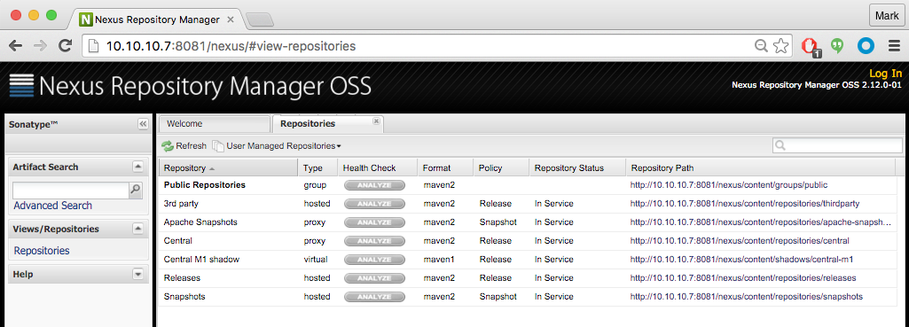
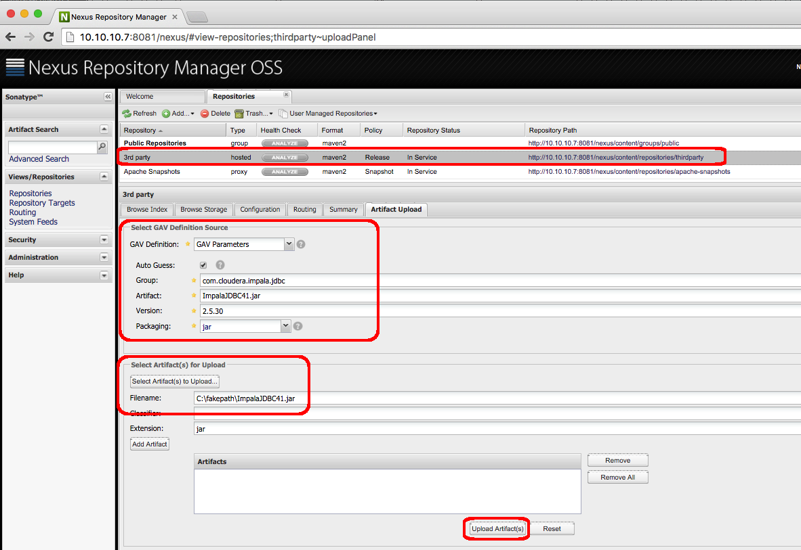
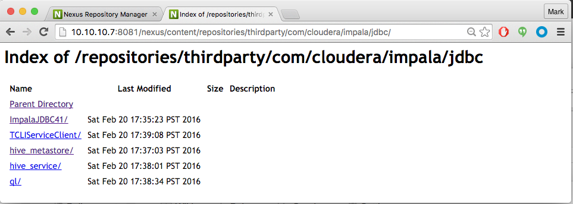
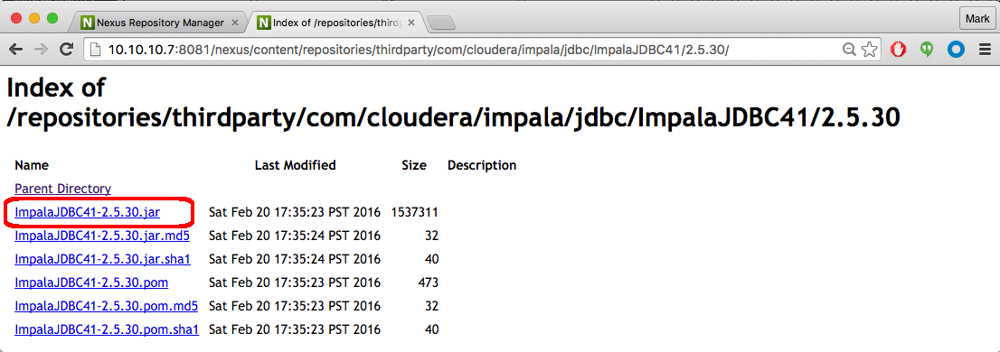

###Cloudera Impala JDBC Example

[Apache Impala (Incubating)](http://www.cloudera.com/products/apache-hadoop/impala.html) is an open source, analytic MPP database for Apache Hadoop.

This example shows how to build and run a Maven-based project to execute SQL queries on Impala using JDBC

This example was tested using Impala 2.3 included with [CDH 5.5.2](http://www.cloudera.com/downloads/cdh/5-5-2.html) and the [Impala JDBC Driver v2.5.30](http://www.cloudera.com/downloads/connectors/impala/jdbc/2-5-30.html)

When you download the Impala JDBC Driver from the link above, it is packaged as a zip file with separate distributions for JDBC3, JDBC4 and JDBC4.1.  This example uses the distribution for JDBC4.1 on RHEL6 x86_64.  The downloaded zip file contains the following eleven jar files:

	(1)  ImpalaJDBC41.jar
	(2)  TCLIServiceClient.jar
	(3)  hive_metastore.jar
	(4)  hive_service.jar
	(5)  ql.jar
	(6)  libfb303-0.9.0.jar
	(7)  libthrift-0.9.0.jar
	(8)  log4j-1.2.14.jar
	(9)  slf4j-api-1.5.11.jar
	(10) slf4j-log4j12-1.5.11.jar
	(11) zookeeper-3.4.6.jar

The JDBC driver's installation instructions say only that "...you must set the class path to include all the JAR files from the ZIP archive containing the driver that you are using..."

While this works fine for one-off projects, it's a little loose for shops that would rather manage their dependencies using Maven or other build systems. 

Part of the challenge in building a project using those jars with Maven is that some of the jars are not available in public repos and some of them do not have obvious version numbers.  My approach in this example will be to use a local Maven repo to manage the first five jars in the list above and to rely on publicly available Maven repos for jars 6 - 11 (as they have version numbers in their name). 
I will use the community version of the [Nexus Repository Manager OSS](http://www.sonatype.org/nexus/go/) as a local Maven repo

I downloaded Nexus Repository Manager OSS v2.12 from the link [here](http://www.sonatype.org/nexus/go/) and followed the installation instructions [here](http://books.sonatype.com/nexus-book/reference/installing.html) 

Here is the view of my local Nexus repo available after launching it for the first time.  Note there is already a repo named "3rd party" which I will use to manage the first five JDBC driver jars:  

To add jars to the repo, login to the local Nexus repo, go to the 3rd party repo's "upload artifacts" tab and select the desired jar to upload.  I specified a group of "com.cloudera.impala.jdbc" and a version number of "2.5.30" for each of the five jars I uploaded, like this:

Click on the 3rd party repo's URL link and you can browse the uploaded artifacts:

Drill into any of the links and you can see the version number has been appended to each jar:

 
Now that we have a local repo available hosting the JDBC jars, all we need to do is add that repo to our pom with an entry like this:

    <repository>
      <id>YOUR.LOCAL.REPO.ID</id>
      <url><YOUR LOCAL REPO URL></url>
      <name>YOUR.LOCAL.REPO.NAME</name>
      <snapshots>
        <enabled>false</enabled>
      </snapshots>
    </repository>

For example, in my case my local repo entry looks like this:

    <repository>
      <id>nexus.local</id>
      <url>http://10.10.10.7:8081/nexus/content/repositories/thirdparty</url>
      <name>Nexus Local</name>
      <snapshots>
        <enabled>false</enabled>
      </snapshots>
    </repository>

And you can refer to the JDBC artifacts with entries like this:

    <dependency>
      <groupId>com.cloudera.impala.jdbc</groupId>
      <artifactId>ImpalaJDBC41</artifactId>
      <version>2.5.30</version>
    </dependency>

Jars 6 - 11 will be retrieved from the Cloudera and Maven Central repos and will have traditional dependency elements like this:

    <dependency>
      <groupId>org.apache.thrift</groupId>
      <artifactId>libfb303</artifactId>
      <version>0.9.0</version>
    </dependency>

See the pom.xml for details

####Dependencies
To build the project you must have Maven 2.x or higher installed.  Maven info is [here](http://maven.apache.org).

To run the project you must have access to a Hadoop cluster running Impala with at least one populated table defined in the Hive Metastore.

#### Configuring the example

Make sure to set your local repo in pom.xml as described above

Edit the file src/main/resources/ClouderaImpalaJdbcExample.conf and set an Impala daemon's host and port in the connection.url (Impala's default JDBC port is 21050) and set the appropriate JDBC driver class.  I am using JDBC4.1 so my conf file looks like this:

    # ClouderaImpalaJdbcExample.conf
    connection.url = jdbc:impala://chicago.onefoursix.com:21050
    jdbc.driver.class.name = com.cloudera.impala.jdbc41.Driver

See the JDBC driver's docs for more details.

#### Building the example

Build the project like this:

    $ mvn clean package

If this is the first time you are building the project you should see messages like this showing that Maven is retrieving the JDBC jars from your local repo:

    Downloading: http://10.10.10.7:8081/nexus/content/repositories/thirdparty/com/cloudera/impala/jdbc/hive_metastore/2.5.30/hive_metastore-2.5.30.jar
    Downloading: http://10.10.10.7:8081/nexus/content/repositories/thirdparty/com/cloudera/impala/jdbc/hive_service/2.5.30/hive_service-2.5.30.jar
    Downloading: http://10.10.10.7:8081/nexus/content/repositories/thirdparty/com/cloudera/impala/jdbc/ImpalaJDBC41/2.5.30/ImpalaJDBC41-2.5.30.jar
    Downloading: http://10.10.10.7:8081/nexus/content/repositories/thirdparty/com/cloudera/impala/jdbc/ql/2.5.30/ql-2.5.30.jar
    Downloading: http://10.10.10.7:8081/nexus/content/repositories/thirdparty/com/cloudera/impala/jdbc/TCLIServiceClient/2.5.30/TCLIServiceClient-2.5.30.jar

Whereas the other jars (and their dependencies) are downloaded from the public repos:

    Downloading: https://repository.cloudera.com/artifactory/cloudera-repos/org/apache/thrift/libfb303/0.9.0/libfb303-0.9.0.jar
    Downloading: https://repository.cloudera.com/artifactory/cloudera-repos/org/apache/thrift/libthrift/0.9.0/libthrift-0.9.0.jar
    ...

If your build is successful you should see messages like this:

    [INFO] Building jar: /home/mark/a/Cloudera-Impala-JDBC-Example-impala-cdh-5.5.2/cloudera-impala-jdbc-example-1.0.jar
    [INFO] 
    [INFO] --- maven-shade-plugin:2.2:shade (default) @ cloudera-impala-jdbc-example ---
    [INFO] Including com.cloudera.impala.jdbc:hive_metastore:jar:2.5.30 in the shaded jar.
    [INFO] Including com.cloudera.impala.jdbc:hive_service:jar:2.5.30 in the shaded jar.
    ...
    [INFO] ------------------------------------------------------------------------
    [INFO] BUILD SUCCESS
    [INFO] ------------------------------------------------------------------------
    [INFO] Total time: 3.108 s
    [INFO] Finished at: 2016-02-21T11:24:56-08:00
    [INFO] Final Memory: 32M/476M
    [INFO] ------------------------------------------------------------------------

Note that pom.xml is configured to have Maven build an "uber jar" will all dependencies packaged in a single jar and with the main class set

The uber jar will be located at target/cloudera-impala-jdbc-example-uber.jar

#### Running the example using the uber jar

One can run the example using the uber jar with a "java -jar" command with a SQL statement as an argument like this:

    $ java -jar target/cloudera-impala-jdbc-example-uber.jar "SELECT description FROM sample_07 limit 10"

    =============================================
    Cloudera Impala JDBC Example
    Using Connection URL: jdbc:impala://chicago.onefoursix.com:21050
    Running Query: SELECT description FROM sample_07 limit 10

    == Begin Query Results ======================
    All Occupations
    Management occupations
    Chief executives
    General and operations managers
    Legislators
    Advertising and promotions managers
    Marketing managers
    Sales managers
    Public relations managers
    Administrative services managers
    == End Query Results =======================

There is a "run.sh" script provided with that command

#### Running the example using Maven

One can also run the example using Maven using the run-with-maven.sh script which by default passes a SQL statement as an argument:

    mvn exec:java -Dexec.mainClass=com.cloudera.example.ClouderaImpalaJdbcExample -Dexec.arguments="SELECT description FROM sample_07 limit 10"

Your output should look like this:

    $ ./run-with-maven.sh
    [INFO] Scanning for projects...
    ...                                                                        
    [INFO] ------------------------------------------------------------------------
    [INFO] Building cloudera-impala-jdbc-example 1.0
    [INFO] ------------------------------------------------------------------------
    [INFO] 
    [INFO] >>> exec-maven-plugin:1.2.1:java (default-cli) > validate @ cloudera-impala-jdbc-example >>>
    [INFO] 
    [INFO] <<< exec-maven-plugin:1.2.1:java (default-cli) < validate @ cloudera-impala-jdbc-example <<<
    [INFO] 
    [INFO] --- exec-maven-plugin:1.2.1:java (default-cli) @ cloudera-impala-jdbc-example ---
    
    Cloudera Impala JDBC Example
    Using Connection URL: jdbc:impala://chicago.onefoursix.com:21050
    Running Query: SELECT description FROM sample_07 limit 10

    == Begin Query Results ======================
    All Occupations
    Management occupations
    Chief executives
    General and operations managers
    Legislators
    Advertising and promotions managers
    Marketing managers
    Sales managers
    Public relations managers
    Administrative services managers
    == End Query Results =======================
    
    [INFO] ------------------------------------------------------------------------
    [INFO] BUILD SUCCESS
    [INFO] ------------------------------------------------------------------------
