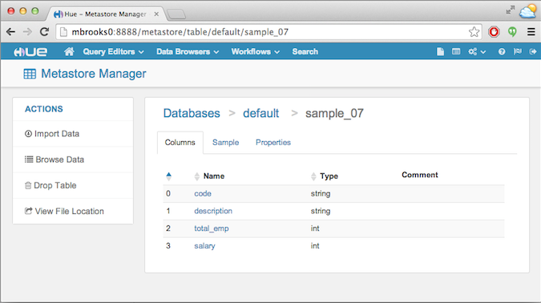

###Cloudera Impala JDBC Example

[Impala](http://www.cloudera.com/products/apache-hadoop/impala.html) (currently an Apache Incubator project) is an open source, analytic MPP database for Apache Hadoop 

This example tested with Impala 2.3.x included with [CDH 5.5.x](http://www.cloudera.com/downloads/cdh/5-5-2.html) and uses the [Impala JDBC Driver v2.5.30](http://www.cloudera.com/downloads/connectors/impala/jdbc/2-5-30.html)

When you download the Impala JDBC Driver from the link above, it is packaged as a zip file, with seperate distributions for JDBC3, JDBC4 and JDBC4.1 for a variety of OS's  This example uses the distribution for JDBC4.1 on RHEL6 x86_64.  The zip file contains the following jar files:

	ImpalaJDBC41.jar
	TCLIServiceClient.jar
	hive_metastore.jar
	hive_service.jar
	ql.jar
	libfb303-0.9.0.jar
	libthrift-0.9.0.jar
	log4j-1.2.14.jar
	slf4j-api-1.5.11.jar
	slf4j-log4j12-1.5.11.jar
	zookeeper-3.4.6.jar

	The installation instructions say to 

This example shows how to build and run a maven-based project to execute SQL queries on Impala using JDBC. 
 
 

Here are links to more information on Cloudera Impala:

 
To use the Cloudera Impala JDBC driver in your own maven-based project you can copy the \<dependency\> and \<repository\> elements from this project's pom to your own (or use this [gist](https://gist.github.com/onefoursix/950e292bf295f0492422) ) instead of manually downloading the JDBC driver jars.

####Dependencies
To build the project you must have Maven 2.x or higher installed.  Maven info is [here](http://maven.apache.org).

To run the project you must have access to a Hadoop cluster running Cloudera Impala with at least one populated table defined in the Hive Metastore.

####Configure the example
To configure the example you must:

- Select or create the table(s) to query against.
- Set the query and impalad host in the example source file

These steps are described in more detail below.

#####Select or create the table(s) to run the example with
For this example I will use the table `sample_07` installed with the [Hue](http://gethue.com) examples as shown in the screenshot below:  

#####Set the query and impalad host
Edit these two setting in the `ClouderaImpalaJdbcExample.java` source file:

#####Set the query and impalad host
Edit these two setting in the `ClouderaImpalaJdbcExample.java` source file:

- Set the SQL Statement:

	`private static final String SQL_STATEMENT = "SELECT description FROM sample_07 limit 10";`
	
- Set the host for the impalad you want to connect to: 

	`private static final String IMPALAD_HOST = "MyImpaladHost";`

####Building the project
To build the project, run the command:

	mvn clean package

from the root of the project directory. 

Note that this will build the project for the version of CDH (Hive andd Hadoop) specified in the POM file. If the version of your CDH differs from the one in that file, run the following script to build the project for your current CDH version:

	./build-for-current-cdh.sh

####Running the example using maven
To run the example using maven, use the command:

	mvn exec:java -Dexec.mainClass=com.cloudera.example.ClouderaImpalaJdbcExample -Dexec.arguments="SELECT description FROM sample_07 limit 10"

from the root of the project directory.  There is a `run-with-maven.sh` script included in this project.

####Sample output
Here is sample output from running the example:

	$ ./run-with-maven.sh 
	[INFO] Scanning for projects...
	[INFO]                                                                         
	[INFO] ------------------------------------------------------------------------
	[INFO] Building cloudera-impala-jdbc-example 1.0
	[INFO] ------------------------------------------------------------------------
	[INFO] 
	[INFO] >>> exec-maven-plugin:1.2.1:java (default-cli) > validate @ cloudera-impala-jdbc-example >>>
	[INFO] 
	[INFO] <<< exec-maven-plugin:1.2.1:java (default-cli) < validate @ cloudera-impala-jdbc-example <<<
	[INFO] 
	[INFO] --- exec-maven-plugin:1.2.1:java (default-cli) @ cloudera-impala-jdbc-example ---

	=============================================
	Cloudera Impala JDBC Example
	Using Connection URL: jdbc:hive2://mbrooks0:21050/;auth=noSasl
	Running Query: SELECT description FROM sample_07 limit 10
	
	== Begin Query Results ======================
	All Occupations
	Management occupations
	Chief executives
	General and operations managers
	Legislators
	Advertising and promotions managers
	Marketing managers
	Sales managers
	Public relations managers
	Administrative services managers
	== End Query Results =======================
	
	
	[INFO] ------------------------------------------------------------------------
	[INFO] BUILD SUCCESS
	[INFO] ------------------------------------------------------------------------
	[INFO] Total time: 3.716 s
	[INFO] Finished at: 2014-08-07T23:23:43-07:00
	[INFO] Final Memory: 16M/225M
	[INFO] ------------------------------------------------------------------------

	
	

####Running the example outside of maven
To run this example outside of maven, add all of the jars that correspond to the dependencies referenced in this project's pom to the classpath.  There is an example `run.sh` script included in this project that provides an example of how to set the classpath.  The script uses "hadoop classpath" to configure the classpath correctly. If the "hadoop" command line utility is not available you may have to edit the script so the paths are correct on your system.

Here are the relevant paths for jars to add to the classpath, using the default locations for Cloudera Impala included in CDH 5.2.1 installed via [parcels](http://blog.cloudera.com/blog/2013/05/faq-understanding-the-parcel-binary-distribution-format/):

        CDH_HOME=/opt/cloudera/parcels/CDH
        HIVE_LIB_DIR=$CDH_HOME/lib/hive/lib
        IMPALA_LIB_DIR=$CDH_HOME/lib/impala/lib
        HADOOP_CLIENT_DIR=$CDH_HOME/lib/hadoop/client

        CLASSPATH=$HADOOP_CLIENT_DIR/hadoop-common.jar
        CLASSPATH=$CLASSPATH:$HADOOP_CLIENT_DIR/httpclient.jar
        CLASSPATH=$CLASSPATH:$HADOOP_CLIENT_DIR/httpcore.jar
        CLASSPATH=$CLASSPATH:$HIVE_LIB_DIR/commons-logging-1.1.3.jar
        CLASSPATH=$CLASSPATH:$HIVE_LIB_DIR/hive-exec.jar
        CLASSPATH=$CLASSPATH:$HIVE_LIB_DIR/hive-jdbc.jar
        CLASSPATH=$CLASSPATH:$HIVE_LIB_DIR/hive-service.jar
        CLASSPATH=$CLASSPATH:$HIVE_LIB_DIR/log4j-1.2.16.jar
        CLASSPATH=$CLASSPATH:$IMPALA_LIB_DIR/slf4j-api-1.7.5.jar
        CLASSPATH=$CLASSPATH:$IMPALA_LIB_DIR/slf4j-log4j12-1.7.5.jar

And here is the output from running the example outside of maven:

	$ ./run.sh 
	
	=============================================
	Cloudera Impala JDBC Example
	Using Connection URL: jdbc:hive2://mbrooks0:21050/;auth=noSasl
	Running Query: SELECT description FROM sample_07 limit 10
	
	== Begin Query Results ======================
	All Occupations
	Management occupations
	Chief executives
	General and operations managers
	Legislators
	Advertising and promotions managers
	Marketing managers
	Sales managers
	Public relations managers
	Administrative services managers
	== End Query Results =======================

