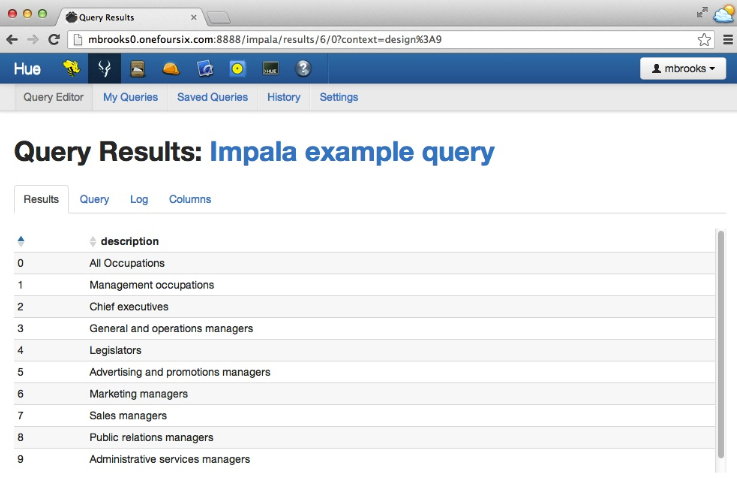

Cloudera Impala JDBC Example
============================

This example shows how to build and run a maven-based project that executes SQL queries on Cloudera Impala using JDBC.  To use the Cloudera Impala JDBC driver in your own project, you can copy the \<dependency\> entries from this project's pom to your own project's pom.

Cloudera Impala is a native Massive Parallel Processing (MPP) query engine which enables users to perform interactive analysis of data stored in HBase or HDFS. 

Here are links to more information on Cloudera Impala:

- [Cloudera Enterprise RTQ](http://www.cloudera.com/content/cloudera/en/products/cloudera-enterprise-core/cloudera-enterprise-RTQ.html) 

- [Cloudera Impala Documentation](http://www.cloudera.com/content/support/en/documentation/cloudera-impala/cloudera-impala-documentation-v1-latest.html)

- [Impala-User Google Group](https://groups.google.com/a/cloudera.org/forum/?fromgroups#!forum/impala-user)

###Dependencies
To build the project you must have Maven 2.x or higher installed.  Maven info is [here](http://maven.apache.org).

To run the project you must have access to a Hadoop cluster running Cloudera Impala with a populated table defined in the Hive Metastore.

###Select a table to run the example with
For this example I will use one of the Hue Beeswax sample tables.  I can see the tables using [Hue](http://gethue.com) as in the screenshot below:  

You can also edit and run queries against Cloudera Impala using Hue.  For this example I will use the trivial query:  "select description from sample_07 limit 10". Here is a screenshot of the Cloudera Impala query results in Hue:

